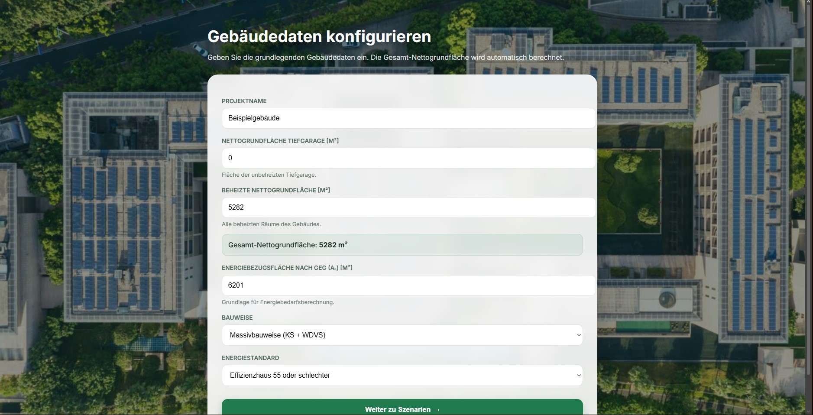
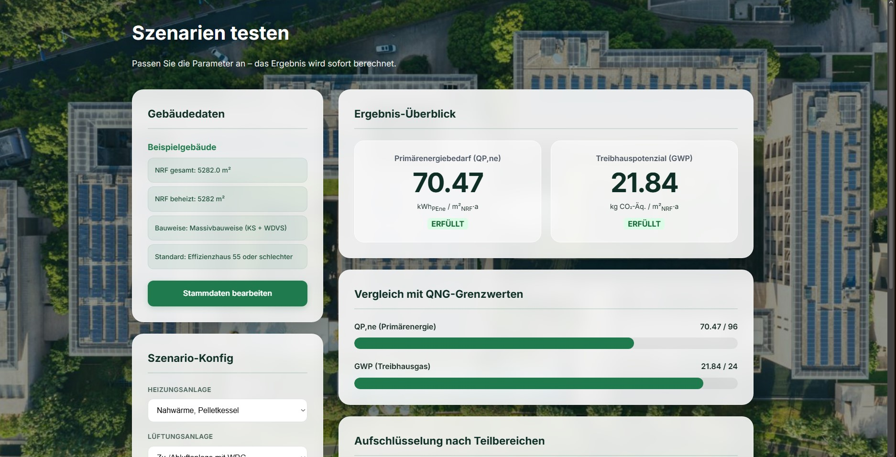

# QNG-Check – Abschätzung der Gebäudeökobilanz

## Projektbeschreibung

Dieses Projekt ist ein Web-Tool zur vereinfachten Abschätzung der Gebäudeökobilanz nach dem **QNG-Standard (Qualitätssiegel Nachhaltiges Gebäude)**.

Ziel ist es, frühzeitig im Planungsprozess eine Einschätzung zu ermöglichen, ob ein Gebäude die Anforderungen an:

* Primärenergiebedarf (QP,ne)
* Treibhauspotenzial (GWP)

erfüllt.

---

## Beispielansicht

### Gebäudedaten

### Szenario & Ergebnis

---

## Ziel des Projekts

* Übertragung komplexer Excel-Berechnungen in ein verständliches Webtool
* Schnelle Szenarioanalyse ermöglichen
* Transparenz über Einflussfaktoren schaffen

---

# Aktueller Stand (Sprint 4)

## Umgesetzte Funktionen

### Gebäudedaten

* Eingabe von Projektname, Energiebezugsfläche (Aₙ), beheizter Nettoraumfläche und Tiefgarage
* Automatische Berechnung der gesamten Nettoraumfläche
* Auswahl von Bauweise und Energiestandard

### Szenarien

* Auswahl verschiedener Heizungs- und Lüftungssysteme
* Berücksichtigung von Photovoltaikfläche und Batteriespeicher
* Auswahl der QNG-Zielanforderung (QNG-PLUS oder QNG-PREMIUM)

### Berechnung

* Berechnung des nicht erneuerbaren Primärenergiebedarfs (QP,ne)
* Berechnung des Treibhauspotenzials (GWP)
* Vergleich mit den jeweiligen QNG-Grenzwerten
* Aufschlüsselung der Ergebnisse nach Teilbereichen

### Visualisierung

* Grafische Darstellung der Ergebnisse
* Farbige Balkendiagramme für die einzelnen Ergebnisbestandteile
* Übersichtliche Darstellung der QNG-Erfüllung

### Testing & Qualitätssicherung

* Automatisierte Tests mit Django Test Framework
* GitHub Actions für Continuous Integration
* Automatische Ausführung der Tests bei Pull Requests
* Branch Protection Rules und Status Checks für den Main-Branch

### Datenbank & Adminbereich

* Einführung erster Django Models für Building und Scenario
* Vorbereitung einer relationalen Datenbankstruktur
* Integration eines Django-Adminbereichs
* Verwaltung von Gebäuden und Szenarien über das Backend

---

## Verwendete Technologien

* Python
* Django
* HTML / CSS
* SQLite
* GitHub
* GitHub Actions

---

## Projektstatus

| Bereich           | Status           |
| ----------------- | ---------------- |
| GUI               | Weiterentwickelt |
| Berechnungslogik  | Funktionsfähig   |
| Visualisierung    | Umgesetzt        |
| Testing           | Automatisiert    |
| GitHub Workflow   | Implementiert    |
| Datenbankstruktur | Vorbereitet      |
| Adminbereich      | Implementiert    |
| Deployment        | In Vorbereitung  |

---

## Nächste Schritte (Sprint 5)

* Kernfunktionalität abschließen
* Hauptworkflow weiter stabilisieren
* Tests erweitern
* Datenbank stärker mit dem Frontend verknüpfen
* Technische Schulden reduzieren
* Dokumentation vervollständigen
* Deployment vorbereiten

