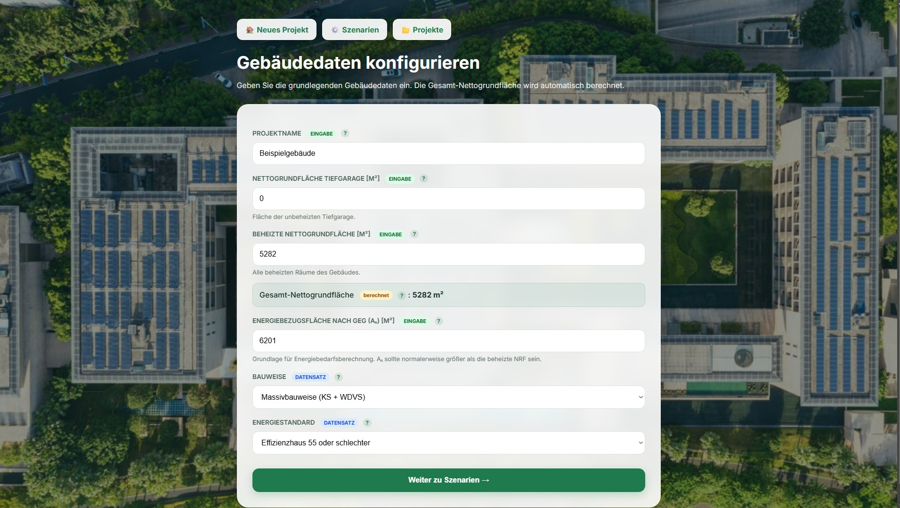
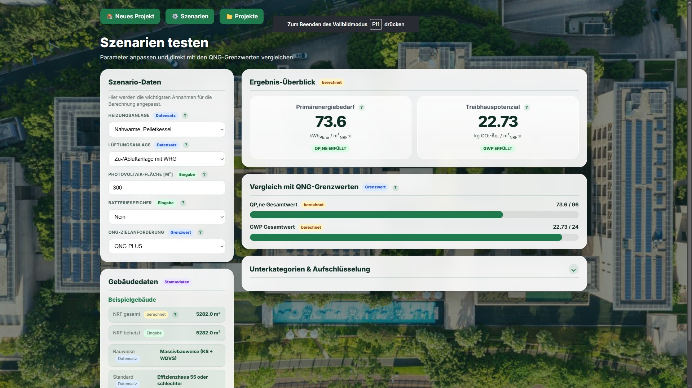
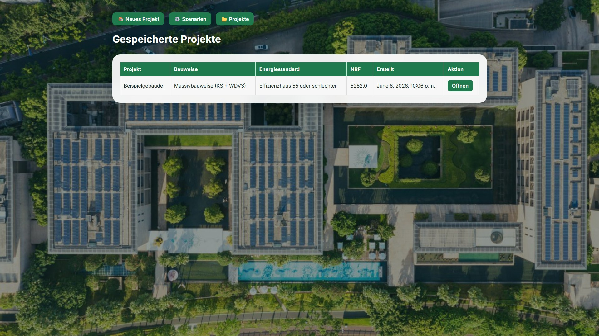
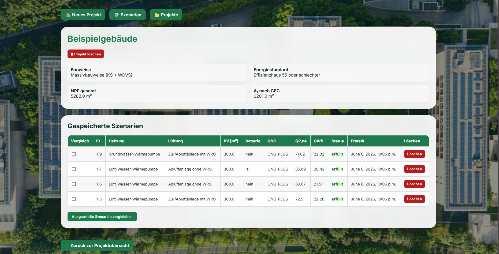
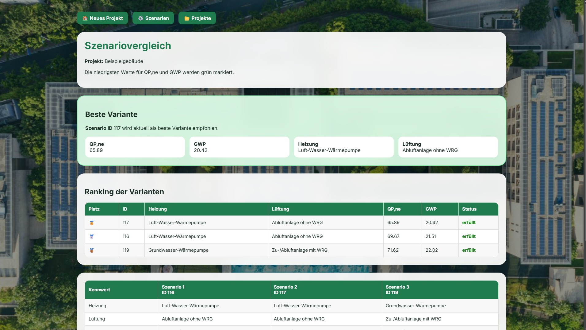

# QNG-Check – Abschätzung der Gebäudeökobilanz

## Projektbeschreibung

QNG-Check ist eine Webanwendung zur vereinfachten Abschätzung der Gebäudeökobilanz nach den Anforderungen des **Qualitätssiegels Nachhaltiges Gebäude (QNG)**.

Die Anwendung unterstützt Planende dabei, bereits in frühen Planungsphasen verschiedene Gebäudeszenarien zu bewerten und hinsichtlich ihrer Nachhaltigkeit zu vergleichen.

Bewertet werden insbesondere:

* Primärenergiebedarf (QP,ne)
* Treibhauspotenzial (GWP)

sowie deren Einhaltung der QNG-Grenzwerte für **QNG-PLUS** und **QNG-PREMIUM**.

---

## Beispielansicht

### Gebäudedaten



### Szenario & Ergebnis



### Projekt & Vergleich





---

## Ziel des Projekts

* Übertragung komplexer Excel-Berechnungen in eine benutzerfreundliche Webanwendung
* Unterstützung bei der Variantenuntersuchung nachhaltiger Gebäude
* Transparente Darstellung von Einflussfaktoren auf QP,ne und GWP
* Vereinfachung der frühen QNG-Bewertung

---

## Funktionsumfang

### Gebäudedaten

Erfassung von:

* Projektname
* Nettogrundfläche beheizt
* Nettogrundfläche Tiefgarage
* Gesamt-Nettogrundfläche (automatisch berechnet)
* Energiebezugsfläche Aₙ nach GEG
* Bauweise
* Energiestandard

### Szenarioanalyse

Auswahl von:

* Heizsystem
* Lüftungssystem
* Photovoltaikfläche
* Batteriespeicher
* QNG-Level (PLUS / PREMIUM)

### Ergebnisdarstellung

* Berechnung von QP,ne
* Berechnung von GWP
* Vergleich mit den QNG-Grenzwerten
* Grafische Ergebnisdarstellung
* Aufschlüsselung der Teilbeiträge

### Projektverwaltung

* Projekte speichern
* Projekte anzeigen
* Projekte löschen
* Szenarien speichern
* Szenarien löschen

### Szenariovergleich

* Vergleich mehrerer Szenarien eines Projekts
* Hervorhebung der besten Variante
* Ranking der Szenarien
* Direkte Gegenüberstellung aller Kennwerte

---

## Automatisierte Tests

Zur Qualitätssicherung wurden automatisierte Tests implementiert.

Getestet werden unter anderem:

* Berechnungslogik für QP,ne und GWP
* QNG-Grenzwerte
* Einfluss von Photovoltaik und Tiefgarage
* Datenbankbeziehungen zwischen Building, Scenario und Result
* Projekt- und Szenarioverwaltung
* Fehlerfälle und Weiterleitungen
* Löschen von Projekten und Szenarien

Tests ausführen:

```bash
python manage.py test
```

---

## Verwendete Technologien

### Backend

* Python
* Django 5

### Frontend

* HTML
* CSS
* JavaScript

### Datenbank

* SQLite

### Versionsverwaltung & Qualitätssicherung

* Git
* GitHub
* GitHub Actions
* Pull Requests
* Branch Protection Rules

---

## Installation

Repository klonen:

```bash
git clone https://github.com/DBM-THA/Absch-tzung-der-Geb-ude-kobilanz-nach-QNG.git
```

Projektordner öffnen:

```bash
cd Absch-tzung-der-Geb-ude-kobilanz-nach-QNG
```

Abhängigkeiten installieren:

```bash
pip install -r requirements.txt
```

Migrationen ausführen:

```bash
python manage.py migrate
```

Server starten:

```bash
python manage.py runserver
```

Anwendung öffnen:

```text
http://127.0.0.1:8000
```

---

## Deployment

Die Anwendung kann lokal mit Django ausgeführt werden.

Start:

```bash
python manage.py runserver
```

---

## Projektstatus (Sprint 5)

| Bereich                 | Status    |
| ----------------------- | --------- |
| GUI                     | umgesetzt |
| Datenstruktur           | umgesetzt |
| Berechnungslogik        | umgesetzt |
| Projektverwaltung       | umgesetzt |
| Szenariovergleich       | umgesetzt |
| Automatisierte Tests    | umgesetzt |
| Workflow-Stabilisierung | umgesetzt |
| Dokumentation           | umgesetzt |
| PDF-Export              | Sprint 6  |

---

## Nächste Schritte (Sprint 6)

* PDF-Bericht generieren
* Erweiterte Diagramme
* Dashboard mit Projektstatistiken
* Weitere Optimierung der Benutzerführung
* Erweiterung der Auswertungsmöglichkeiten

---

## Was ist QNG?

Das Qualitätssiegel Nachhaltiges Gebäude (QNG) ist ein staatlicher Standard zur Bewertung der Nachhaltigkeit von Gebäuden.

Bewertet werden unter anderem:

* Energieeffizienz
* CO₂-Emissionen
* Ressourceneinsatz
* Lebenszyklusbetrachtung

---

## Autoren

**Güllühan Bakir**
**Leon Balliet**

Technische Hochschule Augsburg

Studiengang Digitaler Baumeister
